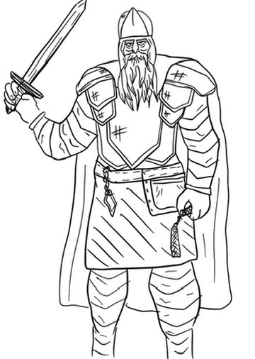
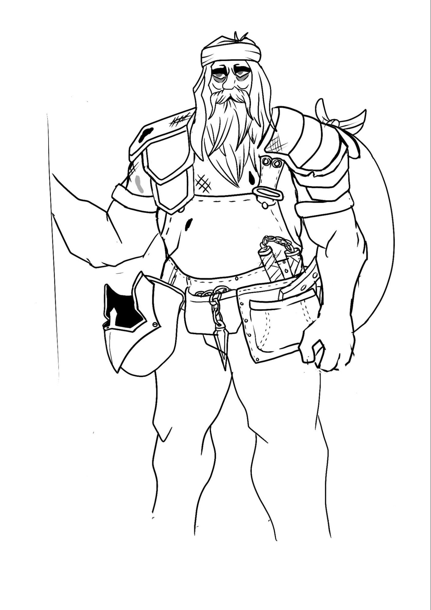
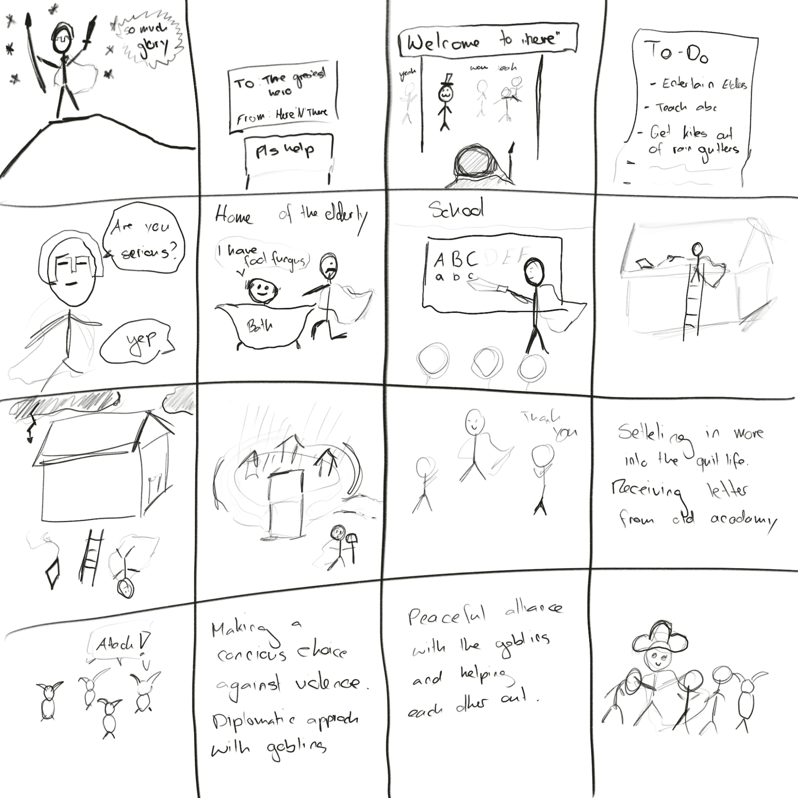
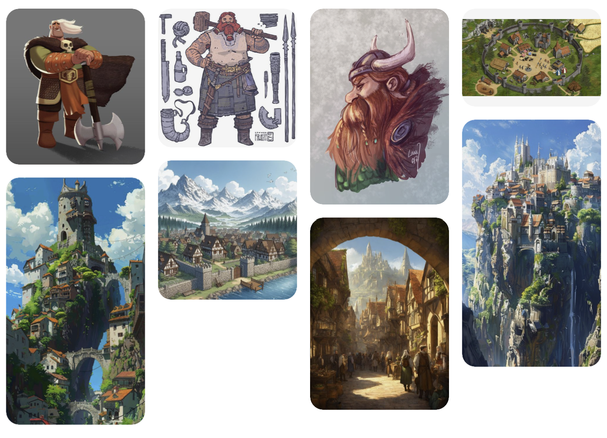
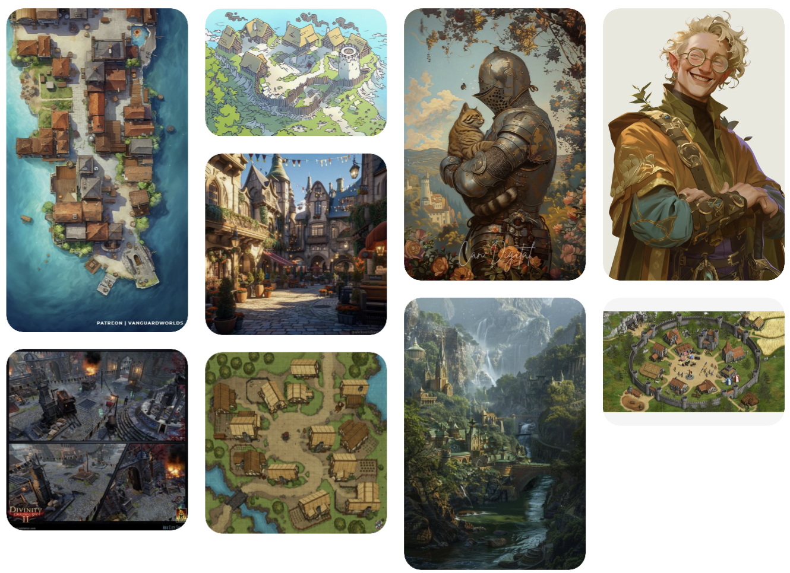
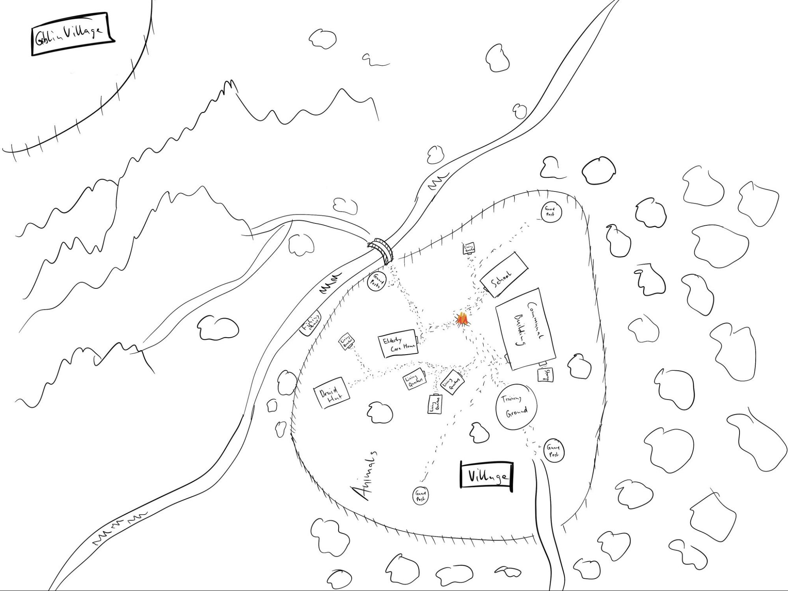

# Spielkonzept - The hero’s quit call
Story written in collaboration with Marina Willi

- [Spielkonzept - The hero’s quit call](#spielkonzept---the-heros-quit-call)
  - [Story Zusammenfassung](#story-zusammenfassung)
    - [Akt 1: Die bescheidenen Aufgaben](#akt-1-die-bescheidenen-aufgaben)
    - [Akt 2: Die Ernüchterung des Helden](#akt-2-die-ernüchterung-des-helden)
    - [Akt 3: Ein Perspektivenwechsel](#akt-3-ein-perspektivenwechsel)
    - [Akt 4: Die Offenbarung des Helden](#akt-4-die-offenbarung-des-helden)
    - [Auflösung: Eine neue Art von Legende](#auflösung-eine-neue-art-von-legende)
  - [Konzept zur Umsetzung des Spiels](#konzept-zur-umsetzung-des-spiels)
  - [Visualisierungen](#visualisierungen)

## Story Zusammenfassung

In einem Königreich, in dem große Quests und epische Schlachten die Norm sind, ist der Held eine Legende unter den Abenteurern. Berühmt für seine unvergleichliche Schwertkunst, taktische Brillanz und Meisterschaft der Magie, hat er Drachen getötet und das Königreich vor zahllosen Gefahren verteidigt. Doch nach einem Jahrzehnt voller Ruhm ist das Reich in eine Ära des Friedens eingetreten, und der Held fühlt sich fehl am Platz und rastlos. Keine Dämonen bedrohen mehr die Tore, keine finsteren Nekromanten lauern in den Schatten. Der Held, auf der Suche nach einem Sinn, folgt einem Hilferuf aus einem Dorf, nur um mit einer Reihe von alltäglichen, scheinbar unbedeutenden Aufgaben betraut zu werden.

### Akt 1: Die bescheidenen Aufgaben

Der Held ist zunächst frustriert von diesen trivialen Aufgaben. Er wird gebeten, im örtlichen Altenheim zu helfen, wo die Bewohner über Gelenkschmerzen klagen und nach Geschichten seiner vergangenen Heldentaten fragen. Anschließend wird er gebeten, Kinder zu unterrichten, die keinen richtigen Lehrer haben, um ihnen das Alphabet beizubringen.

### Akt 2: Die Ernüchterung des Helden

Während er Tage damit verbringt, Zäune zu reparieren, Geschichten zu erzählen und Kinder zu unterrichten, wird der Held müde. Er sehnt sich nach dem Klang von Stahl und der Aufregung des Kampfes. Er vertraut sich seinem alten Knappen an, der nun Wirt ist, und dieser lacht und sagt: „Vielleicht, mein Herr, bedeutet, ein Königreich zu retten, nicht immer, ein Schwert zu schwingen.“ Der Held wischt die Bemerkung beiseite, überzeugt, dass er nur noch eine Randnotiz seiner eigenen Geschichte ist.

### Akt 3: Ein Perspektivenwechsel

Eines Abends bricht ein Sturm über das Dorf herein. Ein Blitz schlägt in das Altenheim ein, was Panik unter den Bewohnern auslöst. Der Held eilt zur Stelle, diesmal nicht mit einem Schwert, sondern mit Mitgefühl. Er beruhigt die verängstigten Bewohner, bringt sie in Sicherheit und nutzt einfache Zauber, um Regen abzuwehren und Lecks zu reparieren. Als die Morgendämmerung anbricht, sieht er Dankbarkeit in ihren Augen und erkennt, dass diese Handlungen, so klein sie auch erscheinen, für die Menschen von unschätzbarem Wert sind.
In der Schule zaubert einer der jungen Magier, die er unterrichtet hat, erfolgreich einen Schutzzauber, um seine Klassenkameraden vor den Resten des Sturms zu schützen, und ruft stolz: „Genau wie der Held es mir beigebracht hat!“ Es wird ihm klar, dass seine Anwesenheit Leben auf eine Weise prägt, die er nie für möglich gehalten hätte.

### Akt 4: Die Offenbarung des Helden

Der Held beginnt, seine neue Rolle zu akzeptieren, und erkennt, dass seine legendären Fähigkeiten nun Werkzeuge sind, um das einfache Volk zu erheben und zu schützen. Er organisiert ein Fest für die Kinder, hilft den Bauern mit Schutzzaubern, die reichliche Ernten sichern, und wird zu einer geschätzten Figur im Dorf. Die Dorfbewohner hören auf, ihn als entfernten, unerreichbaren Helden zu sehen, und beginnen, ihn mit Wärme und Vertrautheit als Freund zu bezeichnen.
Höhepunkt:
Der Frieden wird gestört, als eine kleine, übersehene Bedrohung auftaucht: eine Gruppe vertriebener Goblins, die von ihrem Zuhause vertrieben wurden, beginnt, die Außenbezirke zu plündern. Der Held verteidigt das Dorf, jedoch nicht mit tödlicher Gewalt, sondern durch Verhandlungen mit dem Anführer der Goblins und das Angebot seiner Hilfe. Die Goblins griffen nur an, weil sie selbst kämpften und einen Helden brauchten. Diese Begegnung festigt seine Position als wahrer Held – nicht nur als Krieger, sondern als Wächter und Beschützer im umfassendsten Sinne.

### Auflösung: Eine neue Art von Legende

Im ganzen Königreich verbreitet sich die Nachricht, nicht von dem Held, dem Drachentöter, sondern von dem Held, dem Held des Volkes. Der König lobt ihn dafür, Frieden und Stabilität auf eine Weise zu bringen, wie es Schlachten und Eroberungen niemals könnten. Der Held erkennt, dass seine größte Aufgabe nicht darin bestand, mythische Bestien zu besiegen, sondern Sinn in den kleinen, unsichtbaren Taten der Freundlichkeit zu finden, die das Königreich gedeihen lassen. Die Geschichte endet damit, dass er ein Dorffest anführt, umgeben von lachenden Kindern, dankbaren Ältesten und Bauern, die Geschichten darüber erzählen, wie der Held zum Herz ihrer Gemeinschaft wurde.

- Konflikt und Auflösung:
  - Äußerer Konflikt: Die Herausforderung, den Dorfbewohnern zu helfen und mit den Goblins zu verhandeln.
  - Innerer Konflikt: Kampf, in einer friedlichen Welt seinen Zweck neu zu definieren.
  - Auflösung: Er akzeptiert seine neue Identität als Held, der nicht nur kämpft, sondern auch schützt und unterstützt.

## Konzept zur Umsetzung des Spiels 

- Allgemeine Informationen
  - Spielname: The hero's quit call
  - Genre: Storydriven, Adventure
  - Zielgruppe:
    - Alter: 20-40
    - Interessen:
      - Fiction und Fantasy interessiert
      - Interesse an folgenden Game-Genres: Role-playing Games, Visual Novels, Interactive Story Games, Fantasy Strategy Games, Dungeons and Dragons
      - Erfahrungslevel: keine Erfahrung notwendig, grosses Interesse an Story Basierten Games im Fantasy Bereich
  - Zusammenfassung: Einem Held werden langweilige, für ihn unbedeutende Aufgaben gegeben, aber er lernt, dass diese Ebenfalls wichtig sind und findet neuen Weg, Konflikte zu lösen.
  - Hintergrund: Dungeons and Dragons ähnliche Welt, Dorf ist ein Fantasy Dorf mit Altenheim, Schule, Gemeinschaftshäusern, Lagerhäusern, Feuerplätzen
  - Charaktere: Held, Bürgermeister, die Dorfbewohner mit ihren Anliegen, Wachen, Druiden, Barden, Tiere, Goblins
  - Spielziel: Die Story des Helden erleben und eine Lebenslektion lernen
  - Hauptmechaniken: Anfangs stumpfer Combat mit einem Wechsel zu Aufgaben, die erledigt werden müssen
  - Leveldesign: Das Dorf wird mit mehr erledigten Tasks immer lebendiger und die Leute interagieren mehr mit dem Held, um den Wandel zu zeigen, welcher das Image des Helden durchmacht.
  - Grafikstil: Cartoon-artig, handgezeichnet (vielleicht sogar je weiter man in der Story fortschreitet, desto mehr ist handgezeichnet und fühlt sich persönlicher an)
  - Soundeffekte: schreiende Goblins/ schreiende Kinder/ schreiende ältere Personen
  - Musikstil: Epische Musik, atmosphärische Xylophone Sounds

## Visualisierungen

| Visualisierung                                                                                        | Beschreibung                                                                                                                                                               |
| ----------------------------------------------------------------------------------------------------- | -------------------------------------------------------------------------------------------------------------------------------------------------------------------------- |
|                                                           | Der Held in seiner glorreichen Ausrüstung                                                                                                                                  |
|                                                             | Der Held, nachdem er seine Ausrüstung so angepasst hat, damit sie seinen Aufgaben besser dienen kann. Cape als Rucksack, Helm als Behälter für Baby Katze, Speer als Besen |
|                                                             | Storyboard                                                                                                                                                                 |
|   | Pinterestboard                                                                                                                                                             |
|                                                            | Map of village                                                                                                                                                             |
